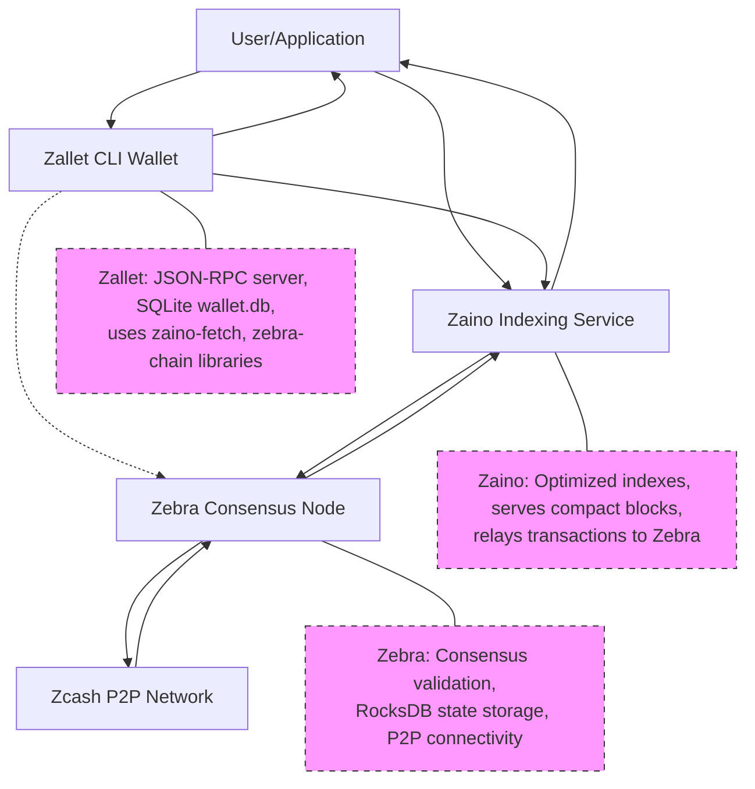

# Z3 Stack: Zebra, Zaino, and Zallet Interplay

## Introduction

The Z3 project consists of three core components that work together to provide a modular replacement for the monolithic `zcashd`: Zebra (the consensus node), Zaino (the indexing service), and Zallet (the wallet application). Understanding their individual roles and how they currently interconnect is crucial for developers and users of the Z3 ecosystem.

## Component Roles

### 1. Zebra: The Consensus Full Node

* **Core Responsibility:** Zebra is the Zcash full-node implementation. It maintains the integrity of the Zcash blockchain by enforcing consensus rules, managing peer-to-peer network connections, and validating all blocks and transactions.
* **Functionality:**
  * Downloads and stores the complete Zcash blockchain.
  * Validates new blocks and transactions against consensus rules.
  * Participates in the Zcash P2P network, gossiping transactions and blocks.
  * Provides RPC/gRPC interfaces for querying raw blockchain data (e.g., blocks, transactions, tree states) and for submitting transactions to the network.
* **Significance:** Zebra serves as the ultimate source of truth for blockchain data within the Z3 stack.

### 2. Zaino: The Indexing Service

* **Core Responsibility:** Zaino acts as a specialized indexing layer that sits between a full node (Zebra) and client applications (like light wallets or Zallet). Its primary goal is to provide a fast, efficient, and queryable source of blockchain data, replacing the functionality of `lightwalletd`.
* **Functionality:**
  * Connects to Zebra to fetch new blocks and blockchain updates.
  * Processes this data and builds optimized indexes (e.g., for compact blocks, transaction histories per address, note commitment tree states).
  * Exposes gRPC and/or RPC interfaces for clients to retrieve this indexed data efficiently.
* **Significance:** Zaino enables performant data retrieval for applications that don't need the full raw blockchain, significantly improving sync times and query speeds for wallets and light clients.

### 3. Zallet: The Wallet Application

* **Core Responsibility:** Zallet is a command-line interface (CLI) wallet that manages user accounts, private keys, and facilitates Zcash transactions. It is designed to provide the wallet functionalities previously embedded within `zcashd`.
* **Functionality:**
  * Securely stores and manages user private keys (encrypted using `age` encryption).
  * Generates and manages Zcash addresses (Transparent, Sapling, Orchard, Unified Addresses).
  * Constructs, signs, and broadcasts transactions.
  * Scans the blockchain (via Zaino) to discover and track transactions relevant to its managed accounts.
  * Maintains a local wallet database for storing account balances, transaction history, and notes.
  * Exposes its own RPC interface for wallet-specific operations.
* **Significance:** Zallet provides the user-facing tools for managing Zcash funds and interacting with the Zcash network for shielded and transparent operations.

## Interactions and Dependencies

The Z3 components currently work together as follows:

**Technical Connection Details:**

* **Zallet to Zaino**: Primarily gRPC communication (via zaino-proto library)
* **Zallet to Zebra**: Occasional direct JSON-RPC/gRPC calls (via zebra-rpc library)  
* **Zaino to Zebra**: JSON-RPC/gRPC to fetch blockchain data
* **User to Components**: JSON-RPC for Zallet wallet operations, gRPC for Zaino data requests

**Key Interaction Flows:**

1. **Blockchain Data Flow:**
    * `Zebra` connects to the Zcash P2P network, downloads, and validates blocks.
    * `Zaino` connects to `Zebra` (its "validator node") to fetch new blocks and tree states. Zaino then processes this data into its indexed database.
    * `Zallet` connects to `Zaino` (specifically, its `FetchServiceSubscriber` interface) to download compact blocks and tree states relevant for its accounts. This allows Zallet to scan for incoming transactions and update its local wallet state.

2. **Transaction Submission:**
    * A user initiates a transaction via `Zallet`.
    * `Zallet` constructs and signs the transaction using its locally stored keys.
    * `Zallet` submits the raw transaction. The primary path for this appears to be via Zaino's `FetchService`, which would then relay it to `Zebra`. `Zallet`'s direct dependencies on `zebra-rpc` also suggest it can make direct calls to Zebra for certain operations.
    * `Zebra` validates the transaction and broadcasts it to the Zcash P2P network.

**Dependencies (as seen in `Cargo.toml` and code):**

* **Zallet depends on:**
  * Zaino libraries (`zaino-fetch`, `zaino-proto`, `zaino-state`) for accessing indexed chain data and possibly for submitting transactions.
  * Zebra libraries (`zebra-chain`, `zebra-rpc`, `zebra-state`) for core Zcash data structures, RPC communication capabilities, and direct state interaction if needed.
* **Zaino depends on:**
  * Zebra libraries (implicitly, as it needs to connect to a Zebra node as its data source). Its internal `FetchService` is configured to point to a validator (Zebra) RPC.
* **Zebra:**
  * Has its own set of internal and Zcash-specific cryptographic dependencies but does not depend on Zaino or Zallet.

## Conclusion

The Z3 stack (Zebra, Zaino, Zallet) creates a robust, modular system for interacting with the Zcash blockchain. Zebra provides the secure consensus foundation, Zaino offers an efficient data indexing and retrieval layer, and Zallet delivers user-facing wallet management. This separation of concerns aims for improved maintainability, scalability, and security compared to the legacy `zcashd` monolith.
