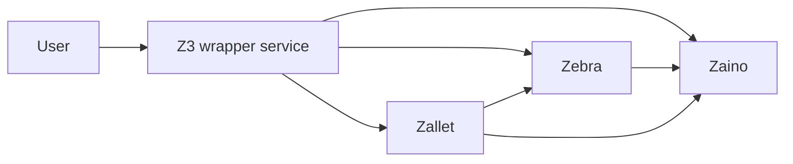

# System Patterns

## Architecture

The system adopts a modular architecture, replacing the monolithic Zcashd with a set of specialized components: Zebra, Zaino, and Zallet. These components interact through well-defined interfaces, enabling independent development, deployment, and scaling. Z3 wrapper service provides a unified entry point for users, simplifying interaction with the underlying components.

## Key Decisions

*   **Rust Implementation:** The decision to implement most components in Rust was driven by a strong emphasis on security and performance. Rust's memory safety features and efficient execution make it well-suited for building critical blockchain infrastructure.
*   **Component Selection:** The choice of Zebra, Zaino, and Zallet was based on their existing functionality, maturity, and alignment with the project's goals. These components provide a solid foundation for building a replacement for Zcashd.

## Design Patterns

*   **Facade:** The Z3 wrapper service implements the Facade pattern, providing a simplified interface to the complex interactions between Zebra, Zaino, and Zallet.
*   **Observer:** Zebra and Zaino may utilize the Observer pattern for event handling, allowing components to react to changes in the blockchain state.
*   **Repository:** Zaino may employ the Repository pattern to abstract data access, simplifying data management and improving testability.

## Component Relationships

*   **User and Z3 wrapper service:** The user interacts directly with the Z3 wrapper service, which acts as a single entry point to the system. The Z3 wrapper service handles user requests and routes them to the appropriate component (Zebra, Zaino, or Zallet).
*   **Zebra and Zaino:** Zebra provides blockchain data to Zaino via RPC or a similar mechanism. Zaino indexes this data to provide efficient access for light clients and other applications.
*   **Zallet and Zebra:** Zallet interacts with Zebra for transaction submission and balance retrieval. Zallet uses Zebra's API to construct and broadcast transactions to the Zcash network.
*   **Zallet and Zaino:** Zallet may interact with Zaino to retrieve indexed blockchain data, such as transaction history or address balances.
*   **Z3 wrapper service and Components:** The Z3 wrapper service orchestrates interactions between Zebra, Zaino, and Zallet, providing a unified interface for users.

## Notes

*   It is not yet clear whether Zallet will communicate only with Zaino or also directly with Zebra. This will depend on the specific requirements of Zallet and the design of the interfaces between the components.
*   There is ongoing discussion about Zaino being implemented as a library that will be integrated directly into wallet software. If this approach is adopted, users may not need to communicate with a separate Zaino service.
