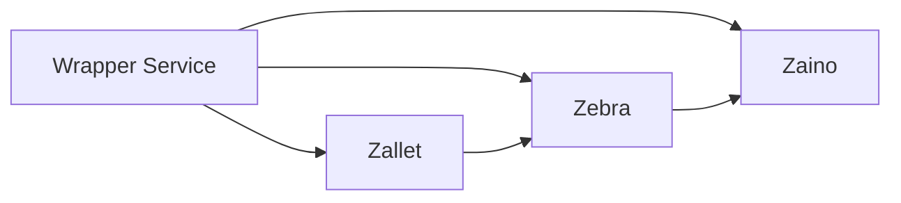

# System Patterns

## Architecture

The system adopts a modular architecture, replacing the monolithic Zcashd with a set of specialized components: Zebra, Zaino, and Zallet. These components interact through well-defined interfaces, enabling independent development, deployment, and scaling. A wrapper service provides a unified entry point for users, simplifying interaction with the underlying components.

## Key Decisions

*   **Rust Implementation:** The decision to implement most components in Rust was driven by a strong emphasis on security and performance. Rust's memory safety features and efficient execution make it well-suited for building critical blockchain infrastructure.
*   **Component Selection:** The choice of Zebra, Zaino, and Zallet was based on their existing functionality, maturity, and alignment with the project's goals. These components provide a solid foundation for building a replacement for Zcashd.

## Design Patterns

*   **Facade:** The wrapper service implements the Facade pattern, providing a simplified interface to the complex interactions between Zebra, Zaino, and Zallet.
*   **Observer:** Zebra and Zaino may utilize the Observer pattern for event handling, allowing components to react to changes in the blockchain state.
*   **Repository:** Zaino may employ the Repository pattern to abstract data access, simplifying data management and improving testability.

## Component Relationships

*   **Zebra and Zaino:** Zebra provides blockchain data to Zaino via RPC or a similar mechanism. Zaino indexes this data to provide efficient access for light clients and other applications.
*   **Zallet and Zebra:** Zallet interacts with Zebra for transaction submission and balance retrieval. Zallet uses Zebra's API to construct and broadcast transactions to the Zcash network.
*   **Wrapper Service and Components:** The wrapper service orchestrates interactions between Zebra, Zaino, and Zallet, providing a unified interface for users.

## Critical Paths

*   **Transaction Processing:** The process of creating, signing, and submitting a transaction to the Zcash network involves interactions between Zallet and Zebra.
*   **Block Synchronization:** Zebra synchronizes with the Zcash network to download and verify new blocks. This process is critical for maintaining an up-to-date view of the blockchain state.
*   **Data Indexing:** Zaino indexes blockchain data provided by Zebra to enable efficient querying and retrieval of information.
